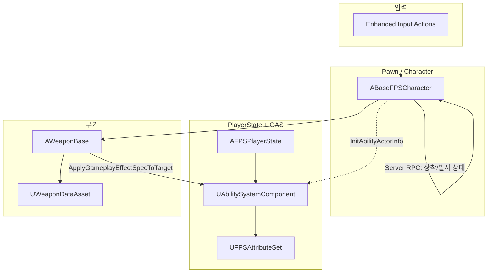

# Ark 모듈 — 포트폴리오 기술 문서

**문서 목적:** `Ark/` 런타임 모듈의 구조·기술 선택·구현 근거를 포트폴리오/이력서용으로 요약한다.  
**근거:** 저장소 내 소스(`Ark/Source/Ark/`), `Ark/Ark.uproject`, 루트 `README.md`의 Phase 체크리스트. 에디터에서만 존재하는 BP·에셋(예: `GE_DefaultAttributes`, `GE_Damage`)은 코드에서 참조되는 경우에만 “에디터 구성 필요”로 표기한다.

---

## 1. 한 줄 요약

**Unreal Engine 5.6** 기반 1인칭 멀티 FPS의 **코어 게임플레이 모듈**로, **Gameplay Ability System(GAS)** 과 **Enhanced Input**, **리슨 서버형 복제**를 전제로 캐릭터·속성·무기(히트스캔/근접)·데미지 파이프라인을 C++에서 구성한다.

---

## 2. 기술 스택 (확인된 사실)

| 항목 | 내용 | 근거 |
|------|------|------|
| 엔진 | UE **5.6** | `Ark/Ark.uproject` → `EngineAssociation` |
| 모듈 | `Ark` (Runtime) | 동일 `uproject` |
| 능력 시스템 | `GameplayAbilities`, `GameplayTags`, `GameplayTasks` | `Ark.Build.cs` 공개 의존성, `GameplayAbilities` 플러그인 활성 |
| 입력 | `EnhancedInput` | `Ark.Build.cs` |
| 복제 | 캐릭터/무기/PlayerState·ASC 등 네트워크 전제 | `BaseFPSCharacter`의 `bReplicates`, `Server*` RPC, `FPSPlayerState` ASC `SetIsReplicated` 등 |

---

## 3. 소스 디렉터리 맵 (상위 폴더)

```
Ark/Source/Ark/
├── Ark.Build.cs          # 모듈 의존성
├── Characters/           # BaseFPSCharacter, AgentA/B
├── Core/                 # GameMode, PlayerController, PlayerState
├── GAS/                  # AttributeSet, GameplayTags, GameplayAbility 스캐폴딩
├── Weapons/              # WeaponBase, 파생 무기, WeaponDataAsset
└── Animation/            # FPSAnimInstance (로코모션용 변수)
```

---

## 4. 아키텍처 개요

아래는 **코드에 나타난 책임 분리**를 기준으로 한 개념도이다 (에디터 전용 에셋은 생략).



---

## 5. 핵심 컴포넌트

### 5.1 캐릭터 (`ABaseFPSCharacter`)

- **1인칭 카메라:** `UCameraComponent`; 메쉬에 `head`(기본) 소켓이 있으면 해당 소켓에 부착, 없으면 캡슐 기준 유지하는 흐름이 `AttachViewCameraToMesh`에 구현됨.
- **이동/시점:** `Enhanced Input`으로 `Move` / `Look` / `Jump` 바인딩.
- **무기:** `Primary` / `Secondary` / `Melee` 3슬롯, `CurrentWeapon` 및 슬롯 복제, `ServerEquipWeapon`, `ServerSetFiring` 등 서버 권한 RPC.
- **GAS 연동:** `PossessedBy` / `OnRep_PlayerState`에서 `InitializeAbilityActorInfo` 호출 패턴.

**근거 파일:** `Ark/Source/Ark/Characters/BaseFPSCharacter.h`, `.cpp`

### 5.2 PlayerState + ASC (`AFPSPlayerState`)

- `IAbilitySystemInterface` 구현, **ASC를 PlayerState에 생성**하고 `SetReplicationMode(Mixed)` 사용.
- `TryApplyDefaultAttributes`: 서버에서 **1회** `DefaultAttributesEffect`(서브클래스 `UGameplayEffect`)를 자기 ASC에 적용.

**근거 파일:** `Ark/Source/Ark/Core/FPSPlayerState.h`, `.cpp`

### 5.3 속성 (`UFPSAttributeSet`)

- **복제되는 속성:** `Health`, `MaxHealth`, `MoveSpeed`, `Armor`, `MaxArmor` (`GetLifetimeReplicatedProps`).
- **데미지 메타 속성:** `Damage` — `PostGameplayEffectExecute`에서 누적 데미지를 읽은 뒤 0으로 리셋하고, **Armor를 먼저 소모**한 뒤 남은 양만 `Health`에 반영.
- 피해 시 `ABaseFPSCharacter::RecordDamageSource`로 Instigator / Causer / Hit Bone 기록(킬로그·피드백 확장용 훅).

**근거 파일:** `Ark/Source/Ark/GAS/FPSAttributeSet.h`, `.cpp`

> **구현 주의(헤더 불일치):** `FPSAttributeSet.h`에 `OnRep_DamageMitigation`, `OnRep_ArmorRegenPerSecond` 선언이 있으나, 동일 헤더에 대응하는 `UPROPERTY` 및 `FPSAttributeSet.cpp` 구현은 확인되지 않는다. 포트폴리오 설명 시 “향후 확장용 스텁”으로 두거나, 빌드 정리 시 제거·완성 중 하나를 택하는 것이 안전하다.

### 5.4 무기 (`AWeaponBase` 및 파생)

- **공통:** `InitializeWeapon`, 소켓 부착/해제, `StartFire`/`StopFire`, 연사 타이머(`RefireRate`, `bFullAuto`).
- **히트스캔:** `ECC_Visibility`와 `ECC_Pawn` **두 채널**로 각각 라인 트레이스 후, **카메라 기준 더 가까운 히트**를 채택.
- **근접:** 구체 스윕(`SweepSingleByChannel`, `ECC_Pawn`).
- **데미지:** `TryApplyGasDamageFromHit` — 공격자·피격자 `PlayerState`의 ASC를 조회해 `DamageGameplayEffect`를 스펙으로 적용, `SetSetByCallerMagnitude`로 수치 전달. 실패 시 `ApplyPointDamage` 폴백.
- **데이터:** `UWeaponDataAsset`으로 수치·`DamageGameplayEffect`를 에디터 데이터로 분리 가능.

**근거 파일:** `Ark/Source/Ark/Weapons/WeaponBase.h`, `.cpp`, `WeaponDataAsset.h`

### 5.5 GameplayAbility 스캐폴딩

- 예: `UGA_WeaponFireRifle` — 활성화 시 `RequestStartFire` / `RequestStopFire`를 호출하고 즉시 `EndAbility` (발사 루프는 캐릭터/무기 쪽과 연동되는 형태).
- `FPSGameplayTags`에 `Data.Damage`, `State.Attacking`, `State.Reloading` 등 **네이티브 태그** 선언; 능력 간 블록/소유 태그로 충돌 완화.

**근거 파일:** `Ark/Source/Ark/GAS/Abilities/`, `GAS/FPSGameplayTags.h` / `.cpp`

### 5.6 애니메이션 (`UFPSAnimInstance`)

- `Speed`, `Direction`, `bIsInAir`, `bIsCrouched` 등 **블루프린트 ABP에서 읽기 쉬운 상태**를 노출.

**근거 파일:** `Ark/Source/Ark/Animation/FPSAnimInstance.h`, `.cpp`

---

## 6. 프로젝트 전체 맥락 (README 기준)

루트 `README.md`에 따르면 저장소는 **멀티 FPS(발로란트/오버워치 스타일)** 로드맵을 Phase로 관리하며, **현재 Phase 3(무기 MVP)·Phase 4(GAS 액션 스캐폴딩) 일부 완료**, **Phase 5(ABP·몽타주·원격 시각화)** 는 미완이다. 포트폴리오에서 “완성도”를 말할 때는 이 구분을 함께 적는 것이 근거에 맞다.

---

## 7. 외부 참고 (학습·비교용)

- [Gameplay Ability System Overview](https://dev.epicgames.com/documentation/en-us/unreal-engine/gameplay-ability-system-for-unreal-engine) — Epic 공식 GAS 개요.

---

## 8. 문서 메타

| 항목 | 값 |
|------|-----|
| 작성 기준일 | 사용자 환경 기준 **2026-04-21** (대화 메타) |
| 대상 경로 | `Ark/Source/Ark/` |
| 불확실성 | 에디터 전용 `.uasset` 목록·정확한 BP 클래스명은 본 문서에서 단정하지 않음 — 코드·README만 근거로 함 |
